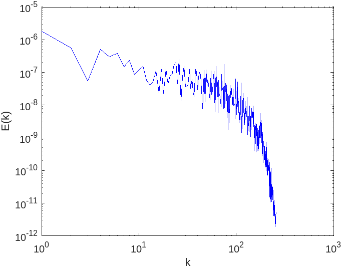

# Stochastic Burgers Turbulence Modelling
The Stochastic Burgers Equation Simulation using DNS and LES .
Direct numerical Simulation and Large eddy Simulation of 1D burgers Equation using Different SGS models have been studied in this project. First the DNS of Burgers Equation solved with N=8192 and $\tau_{ij}$ = 0. then the LES of Burgers equation(N=512) is investigated with 2 Different SGS models.

<figure>
  
  <figcaption>Smagorinsky Energy cascade</figcaption>
</figure>
